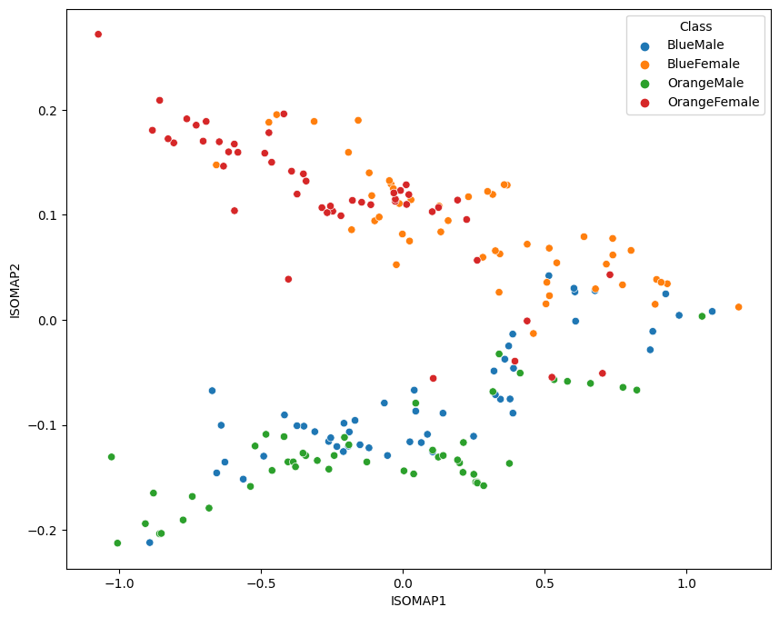
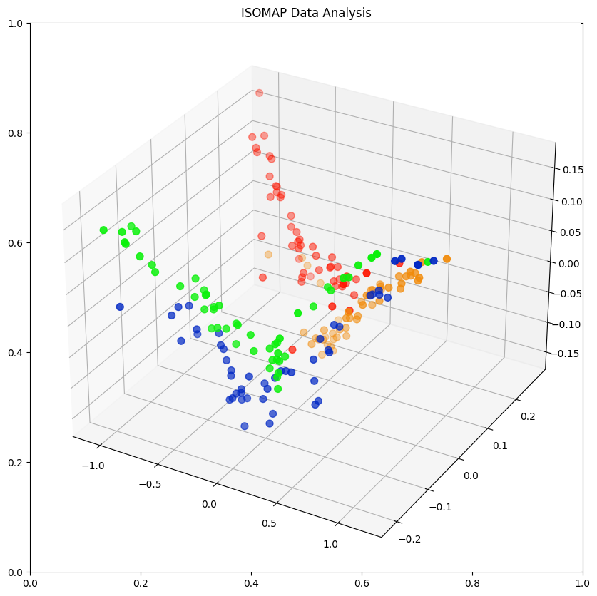

---
jupyter:
  jupytext:
    formats: ipynb,md
    text_representation:
      extension: .md
      format_name: markdown
      format_version: '1.3'
      jupytext_version: 1.14.4
  kernelspec:
    display_name: Python 3 (ipykernel)
    language: python
    name: python3
---

# Isometric Mapping (ISOMAP)

Non-linear dimensionality reduction through Isometric Mapping

```python
import matplotlib.pyplot as plt
from mpl_toolkits.mplot3d import Axes3D
import pandas as pd
import seaborn as sns
from sklearn.preprocessing import MinMaxScaler
from sklearn.manifold import Isomap
```

```python
raw_data = pd.read_csv('data/A_multivariate_study_of_variation_in_two_species_of_rock_crab_of_genus_Leptograpsus.csv')

data = raw_data.rename(columns={
    'sp': 'Species',
    'sex': 'Sex',
    'index': 'Index',
    'FL': 'Frontal Lobe',
    'RW': 'Rear Width',
    'CL': 'Carapace Midline',
    'CW': 'Maximum Width',
    'BD': 'Body Depth'})

data['Species'] = data['Species'].map({'B':'Blue', 'O':'Orange'})
data['Sex'] = data['Sex'].map({'M':'Male', 'F':'Female'})
data['Class'] = data.Species + data.Sex

data_columns = ['Frontal Lobe',
                'Rear Width',
                'Carapace Midline',
                'Maximum Width',
                'Body Depth']

data.head()
```

```python
# generate a class variable for all 4 classes
data['Class'] = data.Species + data.Sex

print(data['Class'].value_counts())
data.head(5)
```

|    | Species | Sex | Index | Frontal Lobe | Rear Width | Carapace Midline | Maximum Width | Body Depth | Class |
| -- | -- | -- | -- | -- | -- | -- | -- | -- | -- |
| 0 | Blue | Male | 1 | 8.1 | 6.7 | 16.1 | 19.0 | 7.0 | BlueMale |
| 1 | Blue | Male | 2 | 8.8 | 7.7 | 18.1 | 20.8 | 7.4 | BlueMale |
| 2 | Blue | Male | 3 | 9.2 | 7.8 | 19.0 | 22.4 | 7.7 | BlueMale |
| 3 | Blue | Male | 4 | 9.6 | 7.9 | 20.1 | 23.1 | 8.2 | BlueMale |
| 4 | Blue | Male | 5 | 9.8 | 8.0 | 20.3 | 23.0 | 8.2 | BlueMale |

```python
# normalize data columns
data_norm = data.copy()
data_norm[data_columns] = MinMaxScaler().fit_transform(data[data_columns])

data_norm.describe()
```

|  | Index | Frontal Lobe | Rear Width | Carapace Midline | Maximum Width | Body Depth |
| -- | -- | -- | -- | -- | -- | -- |
| count | 200.000000 | 200.000000 | 200.000000 | 200.000000 | 200.000000 | 200.000000 |
| mean | 25.500000 | 0.527233 | 0.455365 | 0.529043 | 0.515053 | 0.511645 |
| std | 14.467083 | 0.219832 | 0.187835 | 0.216382 | 0.209919 | 0.220953 |
| min | 1.000000 | 0.000000 | 0.000000 | 0.000000 | 0.000000 | 0.000000 |
| 25% | 13.000000 | 0.358491 | 0.328467 | 0.382219 | 0.384000 | 0.341935 |
| 50% | 25.500000 | 0.525157 | 0.459854 | 0.528875 | 0.525333 | 0.503226 |
| 75% | 38.000000 | 0.682390 | 0.569343 | 0.684650 | 0.664000 | 0.677419 |
| max | 50.000000 | 1.000000 | 1.000000 | 1.000000 | 1.000000 | 1.000000 |


## 2-Dimensional Plot

```python
no_components = 2
k_nearest_neighbors = 10

isomap = Isomap(
    n_components=no_components,
    n_neighbors=k_nearest_neighbors)

data_isomap = isomap.fit_transform(data_norm[data_columns])
print('Reconstruction Error: ', isomap.reconstruction_error())
# Reconstruction Error:  0.009501240251169362

data_norm[['ISOMAP1', 'ISOMAP2']] = data_isomap
data_norm.head(1)
```

|    | Species | Sex | Index | Frontal Lobe | Rear Width | Carapace Midline | Maximum Width | Body Depth | Class | MDS1 | MDS2 | ISOMAP1 | ISOMAP2 |
| -- | -- | -- | -- | -- | -- | -- | -- | -- | -- | -- | -- | -- | -- |
| 0 | Blue | Male | 1 | 0.056604 | 0.014599 | 0.042553 | 0.050667 | 0.058065 | BlueMale | -0.482199 | -0.917839 | 1.091359 | 0.00803 |

```python
fig = plt.figure(figsize=(10, 8))
sns.scatterplot(x='ISOMAP1', y='ISOMAP2', hue='Class', data=data_norm)
```




## 3-Dimensional Plot

```python
no_components = 3
k_nearest_neighbors = 10

isomap = Isomap(
    n_components=no_components,
    n_neighbors=k_nearest_neighbors)

data_isomap = isomap.fit_transform(data_norm[data_columns])
print('Reconstruction Error: ', isomap.reconstruction_error())
# Reconstruction Error:  0.007640087707465774

data_norm[['ISOMAP1', 'ISOMAP2', 'ISOMAP3']] = data_isomap
data_norm.head(1)
```

|    | Species | Sex | Index | Frontal Lobe | Rear Width | Carapace Midline | Maximum Width | Body Depth | Class | ISOMAP1 | ISOMAP2 | ISOMAP3 |
| -- | -- | -- | -- | -- | -- | -- | -- | -- | -- | -- | -- | -- |
| 0 | Blue | Male | 1 | 0.056604 | 0.014599 | 0.042553 | 0.050667 | 0.058065 | BlueMale | 1.091359 | 0.00803 | 0.117078 |

```python
class_colours = {
    'BlueMale': '#0027c4', #blue
    'BlueFemale': '#f18b0a', #orange
    'OrangeMale': '#0af10a', # green
    'OrangeFemale': '#ff1500', #red
}

colours = data_norm['Class'].apply(lambda x: class_colours[x])

x=data_norm.ISOMAP1
y=data_norm.ISOMAP2
z=data_norm.ISOMAP3

fig = plt.figure(figsize=(10,10))
plt.title('ISOMAP Data Analysis')
ax = fig.add_subplot(projection='3d')

ax.scatter(xs=x, ys=y, zs=z, s=50, c=colours)
```



```python

```
